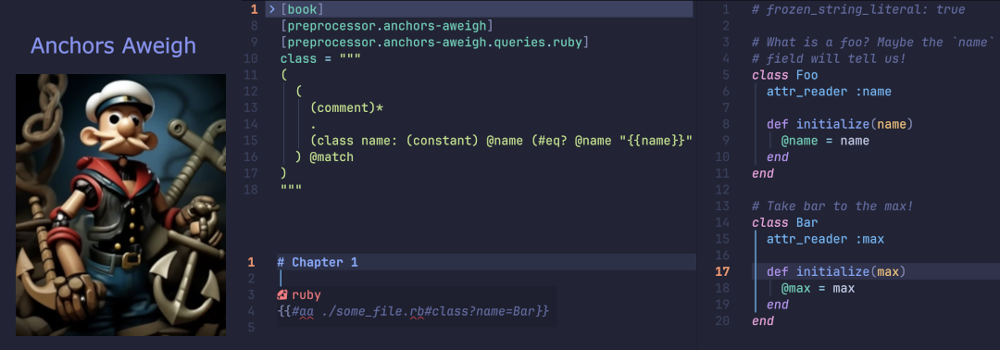

# Anchors Aweigh



> A versatile source inclusion plugin for the [mdBook]
> build system using [treesitter queries] and [handlebars].

## Forward

While working with [mdBook] I fell in love with the [`include`] tag to
tie different pieces of source together in order to keep my documentation
up to date.  After using it for some time I started wishing it could
have just a bit more functionality.  For a time I was using a cocktail
of really great preprocessors to help pick up the slack.  I then reached
a point to where I knew a better tool was needed.

I have a goal to combine many of the great "include" plugins together
under one umbrella.  This is because I wanted to add new kind of "Anchor"
that can select sections of source code.  While the `ANCHOR` and `ANCHOR_END`
tags are great I wanted to be able to use [treesitter queries].  This is
where this project starts but I hope it's not where it ends!

## Example

In this example we'll create a `treesitter` query to select the source code
of a ruby class by name and any optional comments directly above it. Add
the following lines in your `book.toml` configuration file:

```toml
[preprocessor.anchors-aweigh]
[preprocessor.anchors-aweigh.queries.ruby]
class = """
(
  (
    (comment)*
    .
    (class name: (constant) @name (#eq? @name "{{name}}"))
  ) @match
)
"""
```

If you don't understand [treesitter queries] I highly recommend learning
how to read and write them.  They are incredibly handy for analyzing
and working with source code.  What is important to know for this example
is it will match a class with a name and any number of optional comments
right above it.  The handlebars style of `name` becomes a binding we pass
in as anchor parameters.

In a markdown document the following example would then pull in the lines
matched by that query:

```markdown
{{#aa file.rb#class?name=Widget}}
```

## Installing

This project is currently in pre-release and is not yet available on
crates.io.  For the time being it must be built locally.  For that
reason you'll need a [rust environment setup].

1. Clone the repo

   ```bash
   git clone https://github.com/benfalk/anchors-aweigh.git
   ```

2. Compile & Install with Cargo

   ```bash
   cargo install --path=crates/mdbook_anchors_aweigh
   ```

---

[mdBook]: https://rust-lang.github.io/mdBook/
[treesitter queries]: https://tree-sitter.github.io/tree-sitter/using-parsers/queries/1-syntax.html
[`include`]: https://rust-lang.github.io/mdBook/format/mdbook.html#including-files
[rust environment setup]: https://rustup.rs/
[handlebars]: https://github.com/sunng87/handlebars-rust
